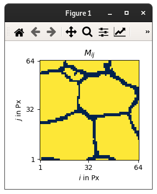

# MCRpy: Microstructure Characterization and Reconstruction in Python

Microstructure characterization and reconstruction (MCR) is an emerging field of computational materials engineering that allows to

1. create a plausible 3D volume element from a 2D slice like a microscopy image for numerical computations,
2. create a set of similar microstructures given one realization, and
3. create smooth transitions between given microstructures by interpolating and sampling in the descriptor space.

MCRpy provides a simple way to characterize a microstructure with a set of descriptors and to reconstruct new microstructures **given these descriptors**.

A key feature of MCRpy is its modularity and extensibility: You can combine **any** descriptors in **any** loss function and use **any** optimizer to solve the emerging optimization problem.

MCRpy can be used
1. as a regular program with graphical user interface (GUI), intended for non-programmers and as an easy introduction to MCR,
2. as a command line tool, intended for automated and large-scale application and for high-performance computers without GUI, and
3. as a PIP-installable Python library, intended for performing advanced and custom operations in the descriptor space.


## Installation

Simple install: To quickly get started, just install via pip using 

`pip install mcrpy`

Editable install: Extensibility is a central advantage of MCRpy. If you want to define your own descriptors and use them for reconstruction, you need an editable install (note the dot at the end). 

`git clone https://github.com/NEFM-TUDresden/MCRpy.git ; pip install -e . `

For HPC: On HPC clusters, it can be challenging to pip-install a Python package and at the same time keep access to pre-compiled modules like tensorflow. If the tensorflow installation has not been compiled for the correct hardware, the MCRpy performance can be quite underwhelming. A simple solution is to 
1. copy the MCRpy source code into the desired workspace
2. load the modules that satisfy the dependencies
3. add MCRpy to the PYTHONPATH

## Dependencies

You need Python >= 3.7 as well as the following packages:

| package         | version |
| ----            | ----    |
| Numpy           | 1.20.1  |
| Tensorflow      | 2.3.1   |
| Matplotlib      | 3.3.4   |
| Scipy           | 1.6.2   |
| pyMKS           | 0.4.1   |
| scikit-learn    | 0.24.1  |
| imageio-ffmpeg  | 0.4.5   |
| Gooey           | 1.0.8.1 |
| pyevtk          | 1.4.1   |

For 3D visualization, you might want to install [paraview](https://www.paraview.org/).

A GPU is technically not needed, but helps a lot and is practically indispensable in 3D.
The code should in principle be platform-independent, but we are testing mainly on Debian.

## Getting started

Drei Beispiele aus Paper und ein paar mehr

Characterize a microstructure to get the descriptors: characterize.py 
- MS needs to be a numpy array stored with np.save() as a npy array
- Descriptors can be given as list
- For MGCorrelations, the limit_to parameters trade off accuracy vs compute

Reconstruct a microstructure given the descriptors: characterize.py 
- The descriptor needs to be a pickle-file written by characterize.py
- Descriptors can be given as list and need a list of weights how strongly they should be considered in the reconstruction
- Again, for MGCorrelations, the limit_to parameters trade off accuracy vs compute


Do characterization and reconstruction in one step: match.py
- Remarks see characterize and reconstruct

View a microstructure or the convergence data from the reconstruction: view.py
- r to toggle rounded/unrounded values
- n to display next MS
- p to display previous MS
- click on blue dots to display corresponding MS
 </img>


## Example gallery


```python
import mcrpy

# define settings
limit_to = 8
descriptor_types = ['Correlations', 'Variation']
descriptor_weights = [1.0, 10.0]
characterization_settings = mcrpy.CharacterizationSettings(descriptor_types=descriptor_types, 
    limit_to=limit_to)
reconstruction_settings = mcrpy.ReconstructionSettings(descriptor_types=descriptor_types, 
    descriptor_weights=descriptor_weights, limit_to=limit_to, use_multigrid_reconstruction=True)

# load microstructures
ms_from = mcrpy.load('microstructures/ms_slice_isotropic.npy')
ms_to = mcrpy.load('microstructures/ms_slice_elongated.npy')

# characterize microstructures
descriptor_isotropic = mcrpy.characterize(ms_from, characterization_settings)
descriptor_elongated = mcrpy.characterize(ms_to, characterization_settings)

# merge descriptors
descriptor_from = mcrpy.merge([descriptor_isotropic])
descriptor_to = mcrpy.merge([descriptor_elongated, descriptor_isotropic])

# interpolate in descriptor space
d_inter = mcrpy.interpolate(descriptor_from, descriptor_to, 5)

# reconstruct from interpolated descriptors and save results
for i, interpolated_descriptor in enumerate(d_inter):
    convergence_data, ms = mcrpy.reconstruct(interpolated_descriptor, (128, 128, 128), 
        settings=reconstruction_settings)
    mcrpy.view(convergence_data)
    smoothed_ms = mcrpy.smooth(ms)
    mcrpy.save_microstructure(f'ms_interpolated_{i}.npy', smoothed_ms)
```

Simple 2D match using MGCorrelations only

    `python match.py --microstructure_filename microstructures/checkerboard_ms_64x64.npy --data_folder results --limit_to_height 8 --limit_to_width 8 --descriptor_types MGCorrelations --descriptor_weights 1.0 --optimizer_type LBFGSB --max_iter 1000 --convergence_data_steps 50`

2D match using MGCorrelations, GramMatrices and TotalVariation

    `python match.py --microstructure_filename microstructures/pymks_ms_64x64.npy --data_folder results --limit_to_height 8 --limit_to_width 8 --descriptor_types MGCorrelations GramMatrices TotalVariation --descriptor_weights 1.0 0.001 0.0001 --optimizer_type LBFGSB --max_iter 1000 --convergence_data_steps 50`

3D match using MGCorrelations only

    `python match.py --microstructure_filename microstructures/checkerboard_ms_64x64.npy --data_folder results --limit_to_height 8 --limit_to_width 8 --descriptor_types MGCorrelations --descriptor_weights 1.0 --optimizer_type LBFGSB --max_iter 1000 --convergence_data_steps 50 --add_dimension 64`

characterize only using MGCorrelations, GramMatrices and TotalVariation

    `python characterize.py --microstructure_filename microstructures/checkerboard_ms_64x64.npy --descriptor_types GramMatrices MGCorrelations TotalVariation --data_folder results`

2D reconstruct only using MGCorrelations only

    `python reconstruct.py --descriptor_filename results/checkerboard_ms_64x64_characterisation.pickle --descriptor_types MGCorrelations --descriptor_weights 1.0 --data_folder results --extent_x 64 --extent_y 64`

View a microstructure

    `python view.py microstructures/checkerboard_ms_64x64.npy`

View convergence data

    `python view.py results/convergence_data.pickle`


## Information
TODO das hier alles links

This code has been written by:
* Paul Seibert, TU Dresden, Institute of solid mechanics
In cooperation with:
* Alexander Rassloff, TU Dresden, Institute of solid mechanics
* Marreddy Ambati, TU Dresden, Institute of solid mechanics
* Markus Kaestner, TU Dresden, Institute of solid mechanics

The following papers describe this work in different ways:
* Central idea and the differentiable extension of n-point correlations: Seibert et al., Reconstructing random heterogeneous media through differentiable optimization, COMMAT, 2021
* Extension to 3D: Seibert et al., Descriptor-based reconstruction of three-dimensional microstructures through gradient-based optimization, Acta Materialia, 2022
* MCRpy as a library: Seibert et al., Microstructure Characterization and Reconstruction in Python - MCRpy, ArXiv, 2022

Please cite at least one of these sources if you use MCRpy in your work.

## License
MCRpy is published under the [Apache 2.0 license](http://www.apache.org/licenses/LICENSE-2.0).

