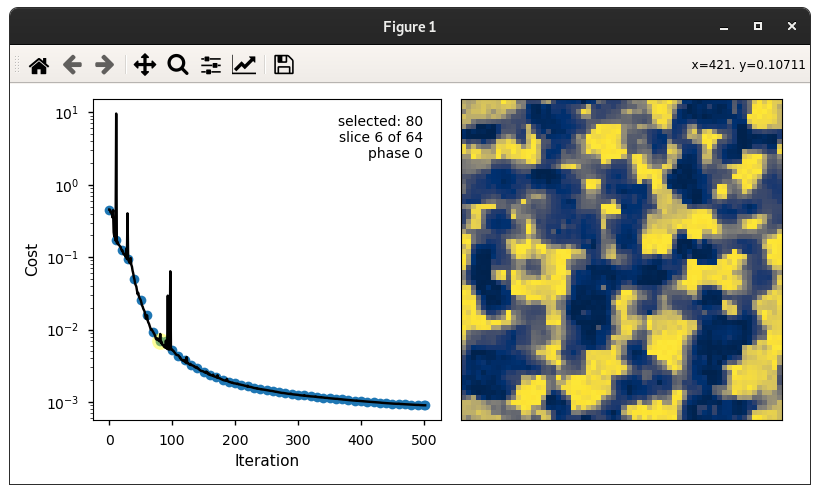
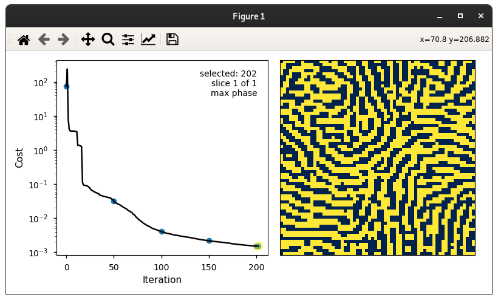

# MCRpy 
## Microstructure Characterization and Reconstruction in Python

Microstructure characterization and reconstruction (MCR) is an emerging field of computational materials engineering that allows to

1. create a plausible 3D volume element from a 2D slice like a microscopy image for numerical computations,
2. create a set of similar microstructures given one realization, and
3. create smooth transitions between given microstructures by interpolating and sampling in the descriptor space.

MCRpy provides a simple way to characterize a microstructure with a set of descriptors and to reconstruct new microstructures **given these descriptors**.

A key feature of MCRpy is its modularity and extensibility: You can combine **any** descriptors in **any** loss function and use **any** optimizer to solve the emerging optimization problem.

**Contents**:  
[1) Installation](#installation)  
&nbsp;&nbsp;&nbsp;&nbsp;&nbsp;&nbsp;[a) Simple install](#simple-install)  
&nbsp;&nbsp;&nbsp;&nbsp;&nbsp;&nbsp;[b) Editable install](#editable-install)  
&nbsp;&nbsp;&nbsp;&nbsp;&nbsp;&nbsp;[c) HPC install](#for-hpc)  
[2) Dependencies](#dependencies)  
[3) Getting started](#getting-started)  
&nbsp;&nbsp;&nbsp;&nbsp;&nbsp;&nbsp;[a) Graphical user interface](#mcrpy-graphical-user-interface)  
&nbsp;&nbsp;&nbsp;&nbsp;&nbsp;&nbsp;[b) Command line interface](#mcrpy-command-line-interface)  
&nbsp;&nbsp;&nbsp;&nbsp;&nbsp;&nbsp;[c) Python package](#mcrpy-as-a-python-package)  
[4) Examples](#examples)  
&nbsp;&nbsp;&nbsp;&nbsp;&nbsp;&nbsp;[a) Quick start](#quick-start)  
&nbsp;&nbsp;&nbsp;&nbsp;&nbsp;&nbsp;[b) Single-phase vs multi-phase](#single-phase-vs-multi-phase)  
&nbsp;&nbsp;&nbsp;&nbsp;&nbsp;&nbsp;[c) Multigrid](#multigrid)  
&nbsp;&nbsp;&nbsp;&nbsp;&nbsp;&nbsp;[d) Descriptors](#descriptors)  
&nbsp;&nbsp;&nbsp;&nbsp;&nbsp;&nbsp;[e) Descriptor weights](#descriptor-weights)  
[5) Extending MCRpy by plugins](#extending-mcrpy-by-plugins)  
[6) Information](#information)  
[7) License](#license)

## Installation

### Simple install
To quickly get started, just install via pip using 

`pip install mcrpy`

### Editable install
Extensibility is a central advantage of MCRpy. If you want to define your own descriptors and use them for reconstruction, you need an editable install (note the dot at the end). 
This will also download the example images and microstructures.

`git clone https://github.com/NEFM-TUDresden/MCRpy.git ; pip install -e . `

### For HPC
On HPC clusters, it can be challenging to pip-install a Python package and at the same time keep access to pre-compiled modules like tensorflow. If the tensorflow installation has not been compiled for the correct hardware, the MCRpy performance can be quite underwhelming. A simple solution is to 
1. copy the MCRpy source code into the desired workspace
2. load the modules that satisfy the dependencies
3. add MCRpy to the `$PYTHONPATH`

## Dependencies

You need Python >= 3.7 as well as the following packages:

| package         | version |
| ----            | ----    |
| Numpy           | 1.20.1  |
| Tensorflow      | 2.3.1   |
| Matplotlib      | 3.3.4   |
| Scipy           | 1.6.2   |
| pyMKS           | 0.4.1   |
| scikit-learn    | 0.24.1  |
| imageio-ffmpeg  | 0.4.5   |
| Gooey           | 1.0.8.1 |
| pyevtk          | 1.4.1   |

For 3D visualization, you might want to install [paraview](https://www.paraview.org/).

A GPU is technically not needed, but helps a lot and is practically indispensable in 3D.
The code should in principle be platform-independent, but we are testing mainly on Debian.

## Getting started

MCRpy can be used
1. as a regular program with graphical user interface (GUI), intended for non-programmers and as an easy introduction to MCR,
2. as a command line tool, intended for automated and large-scale application and for high-performance computers without GUI, and
3. as a PIP-installable Python library, intended for performing advanced and custom operations in the descriptor space.

### MCRpy graphical user interface
Thanks to the great package [Gooey](https://github.com/chriskiehl/Gooey), MCRpy can be accessed by a simple GUI. This helps to get started and allows MCR to non-programmers.

<p align="center"> </img></p>

The left-hand sind shows a list of all possible actions to perform with MCRpy, naturally starting with characterize and reconstruct. Match is a shortcut, performing characterization and immediate reconstruction from the same descriptors.
When you choose the match action on the left, all possible options are presented in the center and can be set by the user.

**WARNING**: MCRpy is intended as a flexible research platform, not as a stable production software. Not all parameter configurations lead to the expected results. As a starting point for choosing parameters, see the example gallery!

We choose the following settings:
- descriptor_types: Correlations, Variation
- descriptor_weights: 1, 100
- limit_to: 8
- use_multiphase: False
- add_dimension: 64
All other settings are chosen as their standard value.

You can view the original structure, its descriptors and the reconstruction results by the view action in the same GUI.
The original structure is copied to the results folder and displayed directly by MCRpy:

<p align="center"> </img></p>

The corresponding descriptors can be inspected from the `*_characterization.pickle` file:

<p align="center"> </img></p>

You can see that multigrid descriptors with three layers were used and no multiphase.
For three-point correlations, only the subset of two-point correlations are plotted for clarity.
The variation is plotted by a bar plot (not shown here).
You can view the plots interactively or have them saved with the `savefig` option.

The reconstruction results is saved as `last_frame.npy`. 
Because it is 3D, it can not be displayed directly by MCRpy but is exported to paraview.
This requires `savefig` to be set to `True`.

<p align="center"> </img></p>

If you browse to the `convergence_data.pickle` file, you get an interactive display of the convergence data:

<p align="center"> </img></p>

In this window, you can
- click on blue dots to display corresponding MS
- use your mouse wheel to scroll through slices of the microstructure if it is 3D
- press `n` to display next intermediate microstructure
- press `p` to display previous intermediate microstructure
- press `c` to cycle through phase indicator functions and the index of the largest indicator function at each position (max phase)
- press `l` to change y-axis to logarithmic
- zoom and measure with your mouse as in any interactive `Matplotlib` plot

### MCRpy command line interface
The most efficient way to use MCRpy is probably by the command line interface, allowing for automation and HPC application. The same outcome as in the GUI example can be obtained by simply typing

`python match.py --microstructure_filename microstructures/pymks_ms_64x64_1.npy --descriptor_types Correlations Variation --descriptor_weights 1 100 --add_dimension 64  --no_multiphase --limit_to 8`

Note that all settings have the same name as in the GUI.

You can automate this in loops very simply to reconstruct multiple microstructures. The index `i` is passed to the `--information` argument to have it added to all filenames, so the files don't override each other.
```bash
python characterize.py ms_slice.npy --limit_to 8 --descriptor_types Correlations Variation
for i in {1..9} 
do
    python reconstruct.py --descriptor_filename results/ms_slice_characterization.pickle \
        --extent_x 64 --extent_y 64 --extent_z 64 --limit_to 8 --information ${i} \ 
        --descriptor_types Correlations Variation --descriptor_weights 1 100
done
```

### MCRpy as a Python package
You can import MCRpy as a regular Python package to obtain direct access to the underlying objects. In this example, we characterize two microstructure slices, interpolate between them in the descriptor space and reconstruct the interpolated values.

```python
import mcrpy

# define settings
limit_to = 8
descriptor_types = ['Correlations', 'Variation']
descriptor_weights = [1.0, 10.0]
characterization_settings = mcrpy.CharacterizationSettings(descriptor_types=descriptor_types, 
    limit_to=limit_to)
reconstruction_settings = mcrpy.ReconstructionSettings(descriptor_types=descriptor_types, 
    descriptor_weights=descriptor_weights, limit_to=limit_to, use_multigrid_reconstruction=True)

# load microstructures
ms_from = mcrpy.load('microstructures/ms_slice_isotropic.npy')
ms_to = mcrpy.load('microstructures/ms_slice_elongated.npy')

# characterize microstructures
descriptor_isotropic = mcrpy.characterize(ms_from, characterization_settings)
descriptor_elongated = mcrpy.characterize(ms_to, characterization_settings)

# merge descriptors
descriptor_from = mcrpy.merge([descriptor_isotropic])
descriptor_to = mcrpy.merge([descriptor_elongated, descriptor_isotropic])

# interpolate in descriptor space
d_inter = mcrpy.interpolate(descriptor_from, descriptor_to, 5)

# reconstruct from interpolated descriptors and save results
for i, interpolated_descriptor in enumerate(d_inter):
    convergence_data, ms = mcrpy.reconstruct(interpolated_descriptor, (128, 128, 128), 
        settings=reconstruction_settings)
    mcrpy.view(convergence_data)
    smoothed_ms = mcrpy.smooth(ms)
    mcrpy.save_microstructure(f'ms_interpolated_{i}.npy', smoothed_ms)
```

## Examples
The example gallery uses MCRpy on the command line for brevity, but you can do the same in the GUI or on the command line interface.

### Quick start
Simple 2D match using Correlations only.

`python match.py --microstructure_filename microstructures/pymks_ms_64x64_2.npy --limit_to 8 --descriptor_types Correlations`

Do the same thing faster by reducing `limit_to` from its default `16` to `8`.

`python match.py --microstructure_filename microstructures/pymks_ms_64x64_2.npy --limit_to 8 --descriptor_types Correlations`

Do the same thing in 3D. Here, you need to include the variation to the descriptors and set the corresponding weight very high, otherwise you will get noisy results.

`python match.py --microstructure_filename microstructures/pymks_ms_64x64_2.npy --limit_to 8 --descriptor_types Correlations Variation --descriptor_weights 1 100--add_dimension 64`

Do the same thing using also with Gram matrices as descriptors. For Gram matrices, `limit_to` can not be as low as `8` because otherise the internal average-pooling of the VGG-19 would have feature maps of shape 0 or less.

`python match.py --microstructure_filename microstructures/pymks_ms_64x64_2.npy --limit_to 16 --descriptor_types Correlations Variation GramMatrices --descriptor_weights 1 100 1 --add_dimension 64`

You can also just characterize the microstructure without reconstructing it:

`python characterize.py microstructures/pymks_ms_64x64_2.npy --limit_to 16 --descriptor_types Correlations Variation GramMatrices`

And then reconstruct later:

`python reconstruct.py --descriptor_filename results/pymks_ms_64x64_2_characterization.npy --limit_to 16 --descriptor_types Correlations Variation GramMatrices --descriptor_weights 1 100 1 --extent_x 64 --extent_y 64 --extent_z 64`

You can view the original and reconstructed microstructure:

`python view.py microstructures/pymks_ms_64x64_2.npy`

`python view.py results/last_frame.npy`

And to view the convergence data:

`python view.py results/convergence_data.pickle`

### Single-phase vs multi-phase
The multiphase setting is activated by default.
For structures with more than 2 phases, like the composite example given in the `example_microstructures`, it needs to be activated, otherwise you can switch it off.
If you use `--no_multiphase`, MCRpy will not use an indicator function for every phase, but only for phase `1`.
This is more memory-efficient but can sometimes be ill-conditioned. 
For example, `alloy_resized_s.npy` has the grain boundaries marked as `0` and the rest as `1`, so if no multiphase is used, the reconstruction has to be carried out only based on the grains.
The following will fail:

`python match.py --microstructure_filename microstructures/alloy_resized_s.npy --descriptor_types Correlations --no_multiphase`

The second example, `alloy_inverted_s.npy` has phases `0` and `1` swapped and can be reconstructed easily:

`python match.py --microstructure_filename microstructures/alloy_inverted_s.npy --descriptor_types Correlations --no_multiphase`

So it would make sense to use multiphase to just describe both phases and be safe, right?

`python match.py --microstructure_filename microstructures/alloy_resized_s.npy --descriptor_types Correlations`

It turns out that this performs ok, but worse than single phase on the inverted structure for numerical reasons. For multiphase structures, the condition that the sum over all indicator functions should equal `1` at each pixel is only implemented by a penalty method currently, so it is not fulfilled exactly and high weights (`phase_sum_multiplier`) lead to numerical problems.

Generally, correlations as descriptors perform best for convex-shaped inclusions.
With other settings, the convergence might fail.
The Gram matrices are a more robust descriptor to include here.

### Multigrid
There are two settings, `use_multigrid_descriptors` and `use_multigrid_reconstruction`:
- `use_multigrid_descriptors` refers to a reduced descriptor accuracy for long-range information, similar to a feature pyramid, and is described in [this paper](https://www.sciencedirect.com/science/article/abs/pii/S0927025621001804). It applies to characterization and reconstruction.
- `use_multigrid_reconstruction` applies to reconstruction only and requires multigrid descriptors. Here, MCRpy first reconstructs downsampled versions of the structure (recursively). The recursion depth is limited by `2 * limit_to`. For example, for a `128x128` structure and `limit_to = 16`, MCRpy first reconstructs `32x32`, then `64x64` and finally `128x128`, always using the coarse solution as initialization. The advantage is that `max_iter` can be reduced. Also, it is especially important in 3D and for high-resolution structures to "get started".

The convergence curve below comes from the following command:

`python match.py --microstructure_filename microstructures/alloy_inverted_s.npy --descriptor_types Correlations --no_multiphase --use_multigrid_reconstruction`

<p align="center"> </img></p>

### Descriptors
As shown in [this paper](https://www.sciencedirect.com/science/article/abs/pii/S1359645422000520) in Figure 8, there seems to be no single best descriptor for all microstructures, but the optimal choice depends on the microstructure. For example, correlations perform very well for most example microstructures, but not for te copolymer. In this case, Gram matrices are better.

`python match.py --microstructure_filename microstructures/copolymer_resized_s.npy --descriptor_types GramMatrices`

<p align="center"> </img></p>

### Descriptor weights
The `--descriptor_weights` set the weight for each descriptor in the loss function. The default is `1` for each descriptor.
In 3D, it is important that the `Variation` has a sufficiently high weight.
Also, it is important to know that descriptors are computed and prescribed on each slice separately.
For example, **in 2D**, if you do `--descriptor_types Correlations VolumeFractions --descriptor_weights 1 100`, i.e. weight the `VolumeFractions` 100 times higher than the `Correlations`, this does the same as `--descriptor_types Correlations --descriptor_weights 1`, since the information of the `VolumeFractions` is already included in the `Correlations`.
However, **in 3D** this changes a lot for gradient-based reconstruction, because it effectively penalizes variations of the `VolumeFractions` over slices. Every slice has to match the desired `VolumeFractions` **exactly**, whereas the `VolumeFractions` matter little.
For gradient-based reconstruction, this usually means that every single pixel has the desired volume fraction and there is no structure. For the `SimulatedAnnealing` optimizer (Yeong-Torquato-Algorithm), it doesn't matter, since the `VolumeFractions` are fulfilled anyway.

## Extending MCRpy by plugins
Besides normal code contribution by merge request - which is always welcome - you can extend MCRpy very simply by writing plugins for microstructure descriptors, optimizers and loss function. The currently available descriptors, optimizers and losses are also plugins, so you can read this code to see how it's done. As a simple example, here is the descriptor plugin for the volume fraction:
```python
import tensorflow as tf
from mcrpy.src import descriptor_factory
from mcrpy.descriptors.Descriptor import Descriptor

class VolumeFractions(Descriptor):
    is_differentiable = True

    @staticmethod
    def make_singlephase_descriptor(**kwargs) -> callable:

        @tf.function
        def compute_descriptor(indicator_function: tf.Tensor) -> tf.Tensor:
            return tf.math.reduce_mean(indicator_function)
        return compute_descriptor

def register() -> None:
    descriptor_factory.register("VolumeFractions", VolumeFractions)
```

For visualization, the standard behavior is that a bar plot is made for low-dimensional descriptors and a heatmap is made for high-dimensional descriptors. You can change this by overriding `Descriptor.visualize_subplot`in your plugin. See `descriptors/Correlations.py` for an example.

## Information
This code has been written by [Paul Seibert](https://www.researchgate.net/profile/Paul-Seibert) and [Alexander Rassloff](https://www.researchgate.net/profile/Alexander-Rassloff) in the lab of [Markus Kaestner](https://www.researchgate.net/profile/Markus-Kaestner) at the [institute of solid mechanics](https://tu-dresden.de/ing/maschinenwesen/ifkm/nefm), TU Dresden, Germany.

The following papers describe this work in different ways:
* Central idea and the differentiable extension of n-point correlations: [Seibert et al., Reconstructing random heterogeneous media through differentiable optimization, COMMAT, 2021](https://www.sciencedirect.com/science/article/abs/pii/S0927025621001804)
* Extension to 3D: [Seibert et al., Descriptor-based reconstruction of three-dimensional microstructures through gradient-based optimization, Acta Materialia, 2022](https://www.sciencedirect.com/science/article/abs/pii/S1359645422000520)
* MCRpy as a library: Seibert et al., Microstructure Characterization and Reconstruction in Python - MCRpy, ArXiv, 2022

All works are also available on as pre-print on ArXiv

Please cite at least one of these sources if you use MCRpy in your work.

## License
MCRpy is published under the [Apache 2.0 license](http://www.apache.org/licenses/LICENSE-2.0).

